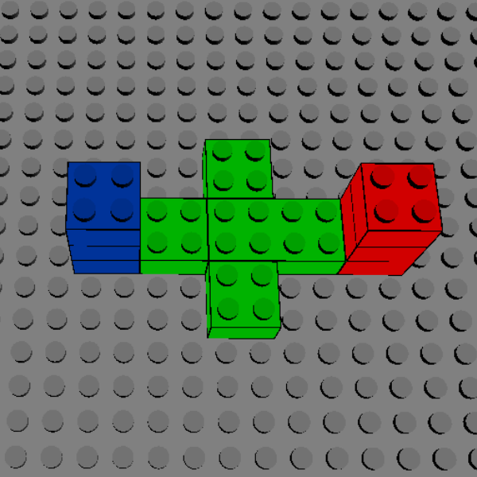

# Experimental Protocol Documentation

## Study Title
Eye-Tracking Data Acquisition During Figure Assembly Using Lego Duplo

## Objective
The aim of this study is to evaluate the performance of different eye movement measurement devices for assembly tasks in a simulated industrial context. Assembly tasks are simulated by building simple structures with Lego Duplo bricks. Our study focuses on the accuracy obtained with each device. In this study, we will test two different configurations:

* A ***stationary*** configuration where two devices are positioned at different points in the participant's workspace.
* A ***mobile*** configuration, where the device takes the form of glasses worn by the participant.

In addition to these two configurations, two experimental scenarios will be studied:

* The participant is in a ***sitting*** position during assembly tasks.
* The participant is in a ***standing*** position during assembly tasks.

## Participants

Participants were psychology students. Eighty participants were recruited.

* 20 participants performed the assembly tasks in a ***sitting*** position with the ***stationary*** configuration.
* 20 participants performed the assembly tasks in a ***standing*** position with the ***stationary*** configuration.
* 20 participants performed the assembly tasks in a ***sitting*** position with the ***mobile*** configuration.
* 20 participants performed the assembly tasks in a ***standing*** position with the ***mobile*** configuration.

Participants were recruited on a voluntary basis. They were remunerated with an experience point to be used in their semester exams.

## Materials and Equipment
- Lego Duplo sets for assembly tasks
- Eye-tracking devices
- Computers for data recording and processing
- Comfortable seating and assembly area

## Procedure

### 1. Recruitment
Recruitment was set up on the LIP/PC2S intranet. To register, participants had to complete an Evento survey and provide their email address. An email was sent to them several days before their session, confirming their participation as well as the date and time of their session. In this email, they were reminded of the inclusion and non-inclusion criteria.

### 2. Preamble to the Experiment and Consent Form

Participants were welcomed in the lobby of the IMAG building, and the experimenter led them to the experimental set.

The experimenter explained the various stages of the experiment, described the eye movement measurement device used during the experiment, and showed an example of Lego Duplo brick assembly. In addition, during this preamble, participants were given an overview of what is recorded by the camera and the eye-tracking devices.

Once the presentation had been made, the experimenter collected signed written consent, then asked for confirmation of inclusion and non-inclusion criteria.

### 3. Preparation for Assembly Tasks and Equipment Calibration
Before starting the assembly tasks, the experimenter ensured that no jewelry or tattoos were visible on the participant's hand or arm. If this was not the case, the jewelry was removed and tattoos hidden using the participant's clothing or sterile compresses and plasters.

Afterwards, the participant had to tie up their hair and remove eye make-up if necessary. The necessary equipment was available at the test site.

The participant then assumed their position (either standing or sitting) in front of the assembly table. The table and chair (if seated) were adjusted so that the table was at the participant's elbow height.

Finally, the eye-tracking device was set up.

### 4. Assembly Task
The participant was given assembly tasks to complete. The procedure is the same for all tasks.

1. The eye-tracking device was calibrated. The calibration was then validated. If the quality of the calibration was insufficient, this step was repeated. In cases where it was impossible to calibrate the device, the experiment was maintained, but the data were not recorded. For each assembly task, eye movements were measured both on the assembly table and on the screen. For the stationary configuration, two devices were used and calibrated: one for the screen and one for the assembly table.
2. The participant's first instruction was displayed on a screen, giving the context and the figure to be assembled. The experimenter placed the first brick of the figure. The other bricks were placed by the participant.
3. At each stage, a visual instruction gave the current position of the brick to be picked up and the new position of the brick in the assembly. The participant had to move from one step to the next using a button on the table.

## Ethical Considerations

This experimental protocol was submitted to and validated by CERGA, the Grenoble Alpes University ethics committee, and received the favorable opinion CERGA-Avis-2023-32.

## Annexes

### Experimental setup

### Eye-Tracking Devices

#### Fovio FX3

#### Tobii Pro 4C

#### Pupil Core Glasses

### Instructions

Instructions are displayed on the screen. A set of instructions is provided to guide the production of each of the requested assemblies (see examples below). For each assembly, the first instruction includes an image of the final assembly to be obtained, as well as a textual description of the different parts of the assembly to be produced. Then, for each brick to be moved, an instruction is provided. This instruction includes an arrow indicating which brick is to be moved, from its origin to its destination. The destination is highlighted. To facilitate the assembly task, the first brick is positioned by the experimenter.

